# Useful Tips for Using Jetbrain User

## Editor

### 1. [Code Auto Compeletion Case Sensetive off](https://roytuts.com/how-to-remove-case-sensitive-from-auto-complete-search-in-intellijidea/)

    - Settings - Editor - General - Code Completion
    - Uncheck Match case

    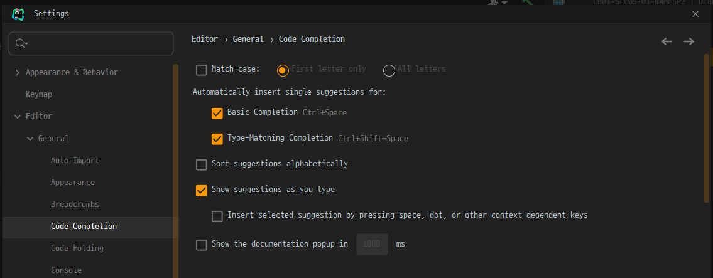</img>

### 2.[Show Virtual Space Option](https://youtrack.jetbrains.com/issue/VIM-2303)

- Settings - Editor - General - Virtual Space - Show virtual space at the bottom of the file
- If you using ideavim and `zz` command not work than try this option

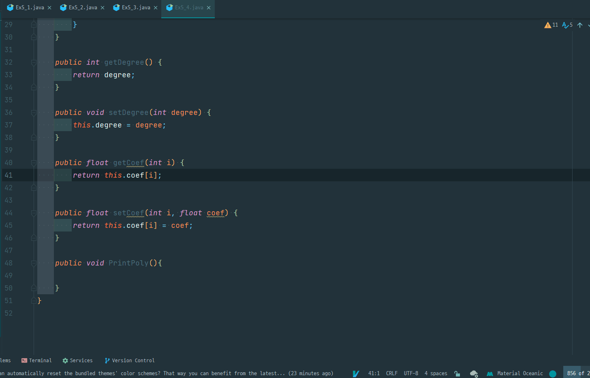</img>

> Last line doesn't properly center with `zz` command (option **OFF**)

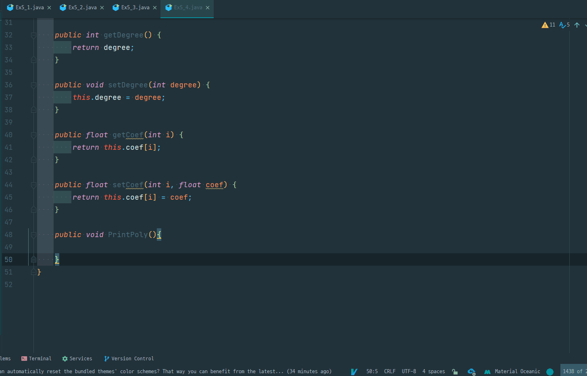</img>

> Now `zz` command properly center (option **ON**)

### 3. Font Ligatures off

- Sometimes some font do looks weired when type certin word. Like ==, !=, \ etc...
- To Fix this problem in Jetbrain's IDE you need to turn off the **Font Ligatures** options.

  - Settings - Editor - Font - Enable ligatures **OFF**

> Enable ligatures

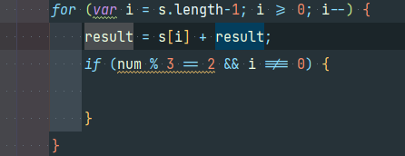

> Disable ligatures

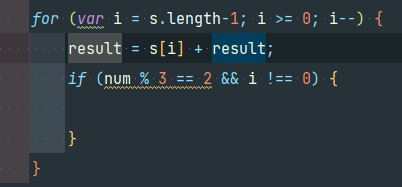

### 4. Variable Column Vertical Alignment

```cpp
  int i = 0;
  int Count = 0;
  Node *List = NULL;
  Node *Current = NULL;
  Node *NewNode = NULL;
```

- You can align variable group vertical just by hitting align button (**Ctrl + Alt + L**)

> Intellij

- Settings - Editor - Code Style - Java - Wrapping and Braces - Group declarations - check **Align variables in columns**
  > Clion
- Settings - Editor - Code Style - C/C++ - Wrapping and Braces - Variable groups - check **Align in columns**

```
  int  i        = 0;
  int  Count    = 0;
  Node *List    = NULL;
  Node *Current = NULL;
  Node *NewNode = NULL;
```

### 5. Wrapping Word

- To wrap word use `Ctrl + Alt + T(Surround With)`

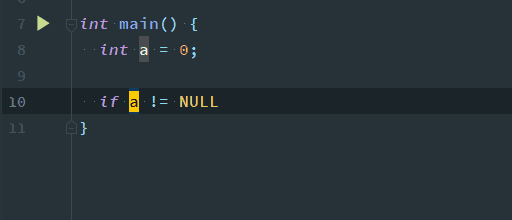

- Also work with HTML tag!

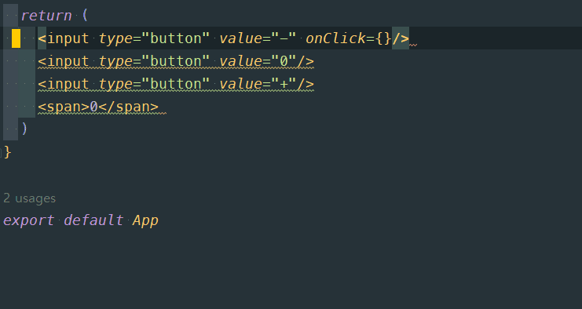

- It works vice versa (which means remove surround tag)

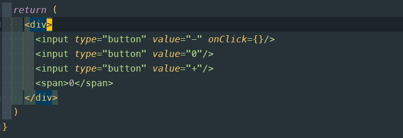

- [reference link](https://gemi.tistory.com/469)

### 6. Extract/Introduce Variable

- To Use `Ctrl + Alt + V(Surround With)`

- Introduce Variable
  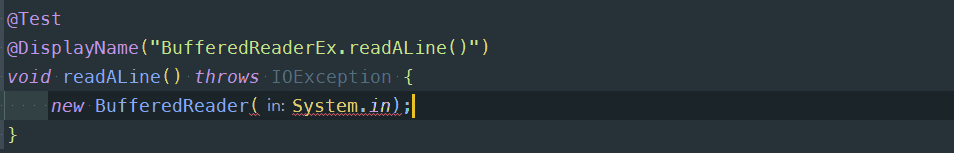

- Extract Variable
  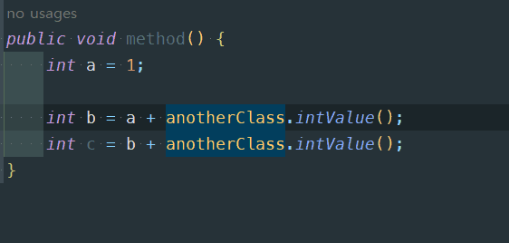

- [reference link](https://www.jetbrains.com/help/idea/extract-variable.html)

### 7. Select Occurrence

- Next Occurrence `F3` or `Ctrl + L`

- Previous Occurrence `Shift + F3` or `Ctrl + Shift + L`

- Select all Occurrence `Ctrl + Shift + Alt + J`

- Unselect Occurrence `Alt + Shift + J`

▶️ [Explaining Video](https://www.jetbrains.com/idea/guide/tips/find-next-word/)

---

### 8. Postfix Completion

- put `.` at the end to complete code

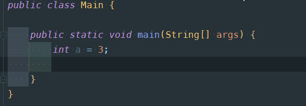

[docs](https://www.jetbrains.com/help/idea/settings-postfix-completion.html)

[Stack Overflow](https://stackoverflow.com/questions/14112623/is-there-a-shortcut-for-wrapping-a-statement-with-system-out-println-in-intellij)

## Debug

### 1. Break when Exception throws

- go to `Run/View BreakPoints`

  - <svg xmlns="http://www.w3.org/2000/svg" width="25" viewBox="0 0 448 512"><!--! Font Awesome Free 6.4.0 by @fontawesome - https://fontawesome.com License - https://fontawesome.com/license/free (Icons: CC BY 4.0, Fonts: SIL OFL 1.1, Code: MIT License) Copyright 2023 Fonticons, Inc. --><path fill="#0178d6" d="M0 93.7l183.6-25.3v177.4H0V93.7zm0 324.6l183.6 25.3V268.4H0v149.9zm203.8 28L448 480V268.4H203.8v177.9zm0-380.6v180.1H448V32L203.8 65.7z"/></svg> `Ctrl + Shift + F8`
  - <svg xmlns="http://www.w3.org/2000/svg" width="25" viewBox="0 0 384 512"><!--! Font Awesome Free 6.4.0 by @fontawesome - https://fontawesome.com License - https://fontawesome.com/license (Commercial License) Copyright 2023 Fonticons, Inc. --><path fill="#b3b3b3" d="M318.7 268.7c-.2-36.7 16.4-64.4 50-84.8-18.8-26.9-47.2-41.7-84.7-44.6-35.5-2.8-74.3 20.7-88.5 20.7-15 0-49.4-19.7-76.4-19.7C63.3 141.2 4 184.8 4 273.5q0 39.3 14.4 81.2c12.8 36.7 59 126.7 107.2 125.2 25.2-.6 43-17.9 75.8-17.9 31.8 0 48.3 17.9 76.4 17.9 48.6-.7 90.4-82.5 102.6-119.3-65.2-30.7-61.7-90-61.7-91.9zm-56.6-164.2c27.3-32.4 24.8-61.9 24-72.5-24.1 1.4-52 16.4-67.9 34.9-17.5 19.8-27.8 44.3-25.6 71.9 26.1 2 49.9-11.4 69.5-34.3z"/></svg> `Cmd + Shift + F8`

- check `Java Exception Breakpoints`

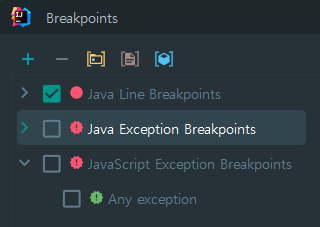

- if you want to check specific exception than follow image
  - For Exclude use `!`
  - For Multiple coditions use `&&`

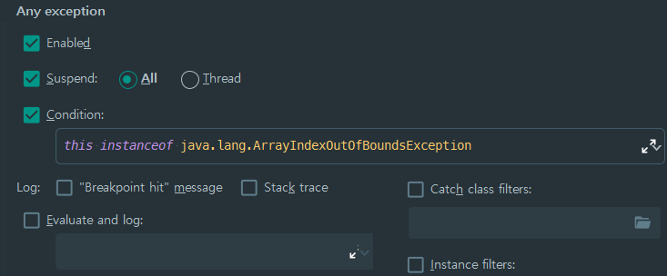

[referece link](https://stackoverflow.com/questions/934794/is-there-break-on-exception-in-intellij)

---

## Etc

### 1. ❌ Disable / Uninstall plugin without launching Idea

- Open FileExplorer than move to `C:\Users\{userName}\AppData\Roaming\JetBrains\{Idea}\plugins`

- Remove the latest plugin that makes you crash
