# VIM Tips

## Comment

- To comment multiple line at once, you can type

```
:{startline}, {endline}s/^/{commentType}
````

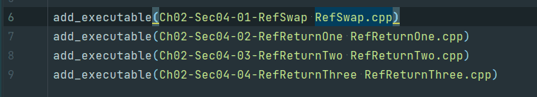

```
:6,7s/^/#
```

## Uncomment

- To Uncomment multiple line at once is vice versa

```
:{startline}, {endline}s/^{commentType}/
```

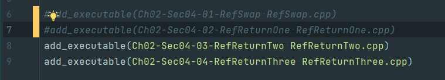

```
:6,7s/^#/
```

[link](https://www.usessionbuddy.com/post/How-To-Comment-Out-And-UnComment-Multiple-Lines-At-Once-In-Vim-Editor/)

---

## Screen Move

- To set current line to center, you can type

```
    zz
```

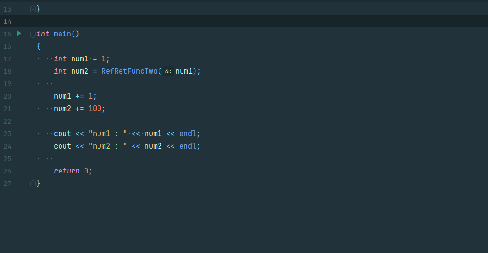

---

## Replace Text

- To replace String in file, you can type

    ```
    :{Scope}/{String1}/{String2}/{Option}
    ```

- Usecase
    1) Replcae all string in file

    ```
    :%s/{String1}/{String2}/g
    ```

    2) Replcae all string in current line (which cursor loacte)

    ```
    :s/{String1}/{String2}/g
    ```

    3) Replace all string from current line to end of file

    ```
    :.,$s/{String1}/{String2}/g
    ```

---

## Adding New Line without Insert mode

- map a new command

    1) Insert new line under current cursor

    ```
    nmap oo o<Esc>k
    ```

    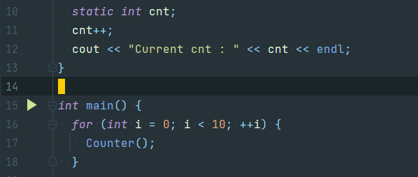

    2) Insert new line over current cursor

    ```
    nmap OO O<Esc>j
    ```

    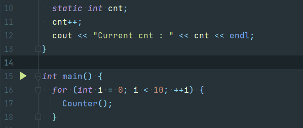

[link](https://stackoverflow.com/questions/16134457/insert-a-newline-without-entering-in-insert-mode-vim)

---

## Autocomplete based on history

- __(NOTE) In IdeaVim you need to map a command in .ideavimrc__

```
imap <C-n> <ESC>:action HippieCompletion<CR>a
imap <C-p> <ESC>:action HippieBackwardCompletion<CR>a
```

- After setup simple use command to compelete code.

```
ctrl + n (HippieCompletion)
ctrl + p (HippieBackwardCompletion)
```

[link](https://stackoverflow.com/questions/30149091/how-to-configure-in-ideavim-ctrl-n-and-ctrl-p-completion-from-vim)

---

## Searching keyword Case Insensitively

- Simply add __\c__ to the keyword

- Example (keyword : __int__)

```
/\cint
```

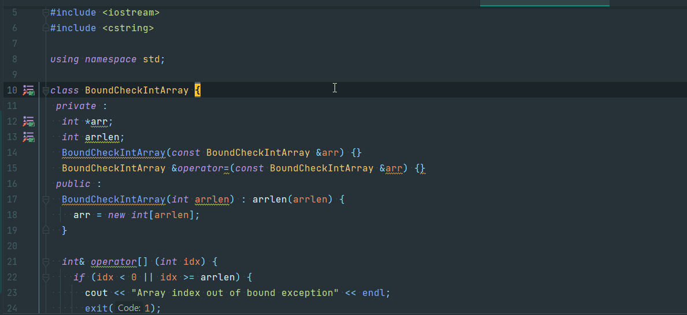

[link](https://ohgyun.com/719)

## Automatic line center after line jump

- __(NOTE) In IdeaVim you need to map a command in .ideavimrc__

```
; Center screen on next/previous selection.
nnoremap n nzz
nnoremap N Nzz
; Last and next jump should center too.
nnoremap <C-o> <C-o>zz
nnoremap <C-i> <C-i>zzimap <C-n> <ESC>:action HippieCompletion<CR>a
imap <C-p> <ESC>:action HippieBackwardCompletion<CR>a
```

- After setup simple use command

```
{Line Number}zz
```

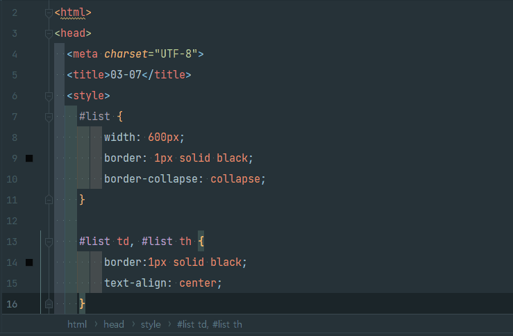

[link](https://stackoverflow.com/questions/2372584/auto-zz-in-vim-after-a-jump)


## Word Select than modify

1) Select Word

`viw`

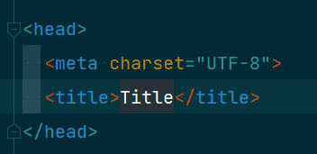

2) Delete Word

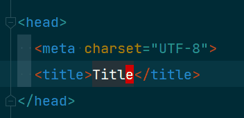

3) Delete than Insert


## Modify single character

1)  Delete Character

`(Normal Mode) x`


`(Normal Mode) r(Enter key)`


## Change case

```
~ (tilt)
```

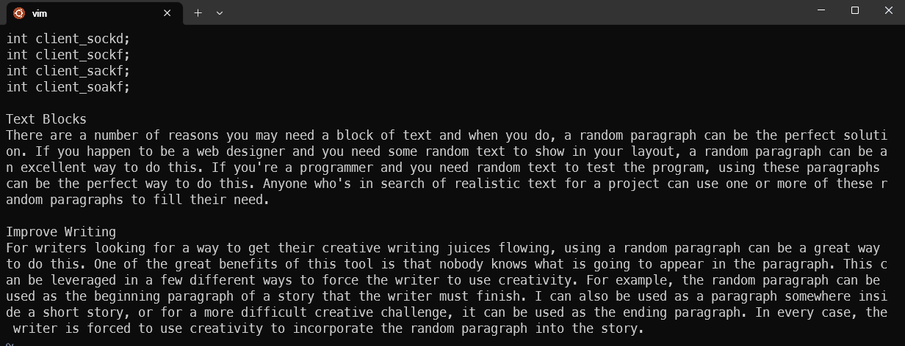

## Cursor Move

1) Movement by Sentence

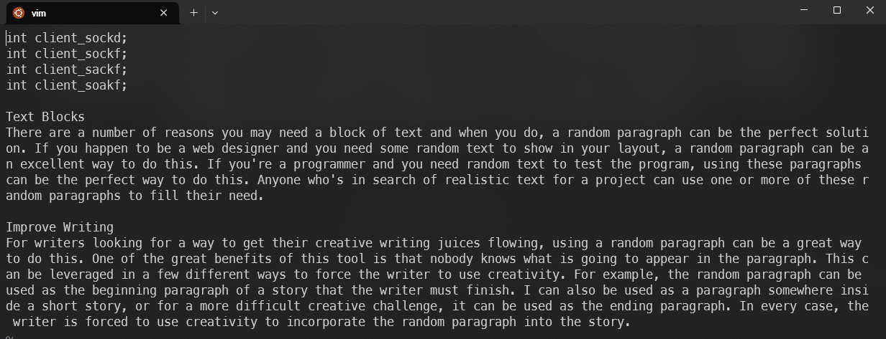

- Forward ```(```

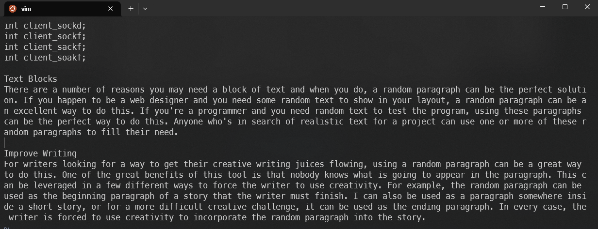

- Backward ```)```

2) Movement by Paragraph

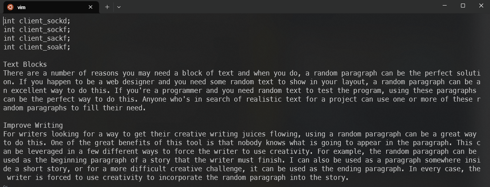

- Forward ```{```

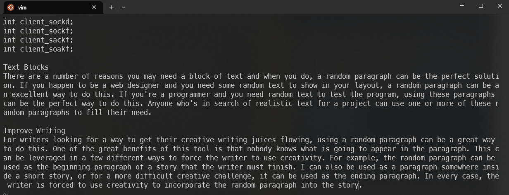

## Multitasking with Vim

```bash
Ctrl + Z
fg
```

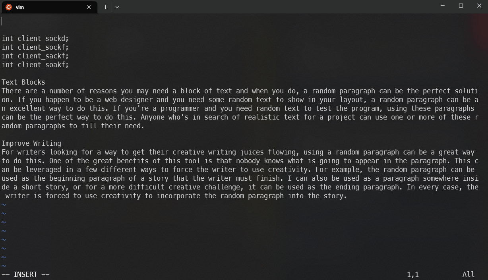