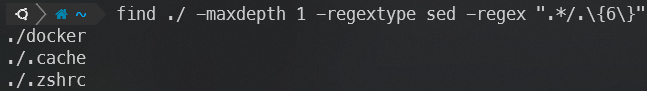

<https://www.hanselman.com/blog/my-ultimate-powershell-prompt-with-oh-my-posh-and-the-windows-terminal>

<https://ohmyposh.dev/docs/installation/windows>


## WSL Terminal

### 1) Open Explorer on WSL Path

```bash
wslview .
```

### 2) Use Find Command with Regex

```bash
find {dir} -regextype sed -regex "{reg}"
```

> Ex) Finding file which name is 6 letter

```bash
find ./ -maxdepth 1 -regextype sed -regex ".*/.\{6\}"
```



- Exclude ___'./'___
- Only count file name

## PowerShell

### 1) Open Explorer on current path

```Powershell
Invoke-Item .
ii .
```

