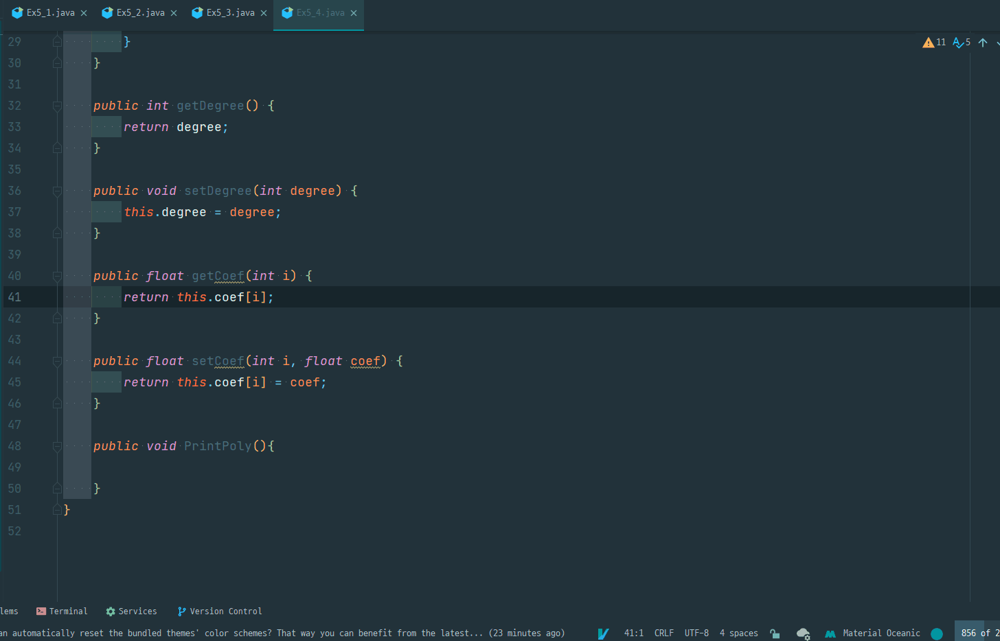
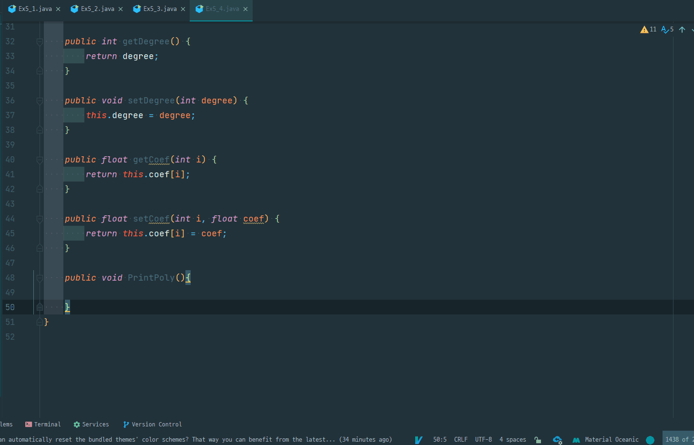

# Useful Tips for Using Jetbrain User

## Editor

1. [Code Auto Compeletion Case Sensetive off](https://roytuts.com/how-to-remove-case-sensitive-from-auto-complete-search-in-intellijidea/)
    - Settings - Editor - General - Code Completion
    - Uncheck Match case

    </img>

2.[Show Virtual Space Option](https://youtrack.jetbrains.com/issue/VIM-2303)

* Settings - Editor - General - Virtual Space - Show virtual space at the bottom of the file
* If you using ideavim and ```zz``` command not work than try this option

</img>
> Last line doesn't properly center with `zz` command (option __OFF__)

</img>
> Now `zz` command properly center (option __ON__)