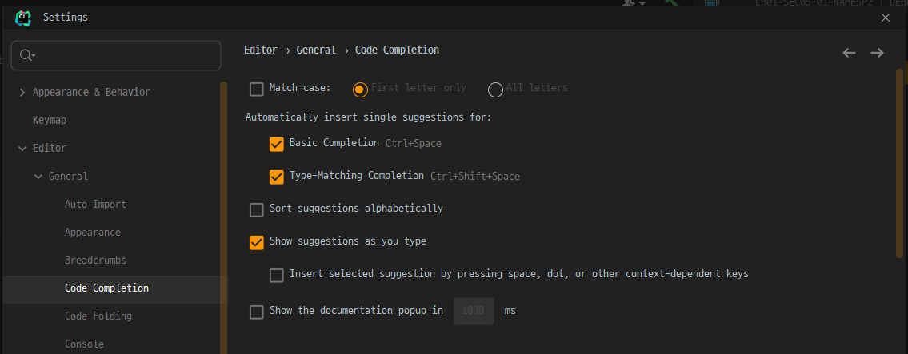

# Useful Tips for Using Jetbrain User

## Editor

1. [Code Auto Compeletion Case Sensetive off](https://roytuts.com/how-to-remove-case-sensitive-from-auto-complete-search-in-intellijidea/)
    - Settings - Editor - General - Code Completion
    - Uncheck Match case

    </img>