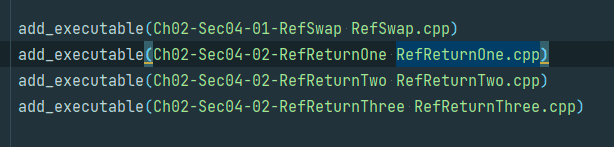
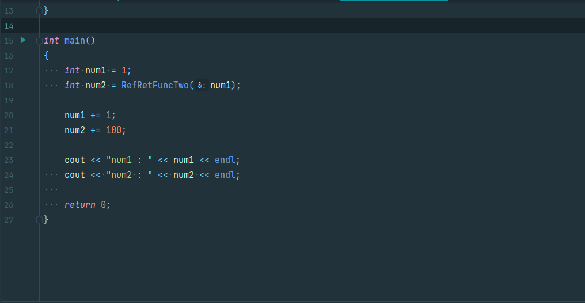

# VIM Tips

## Comment

- To comment multiple line at once, you can type

```
:{startline}, {endline}s/^/{commentType}
````



```
:6,7s/^/#
```

---

## Screen Move

- To set current line to center, you can type

```
    zz
```



---

## Replace Text

- To replace String in file, you can type
    ```
    :{Scope}/{String1}/{String2}/{Option}
    ```

- Usecase
    1) Replcae all string in file
    ```
    :%s/{String1}/{String2}/g
    ```

    2) Replcae all string in current line (which cursor loacte)
    ```
    :s/{String1}/{String2}/g
    ```

    3) Replace all string from current line to end of file
    ```
    :.,$s/{String1}/{String2}/g
    ```