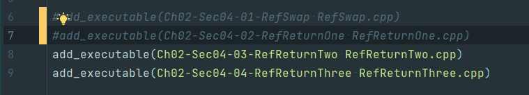
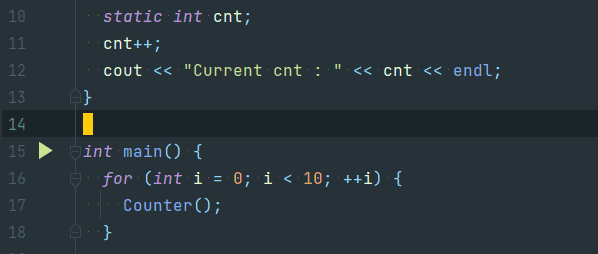
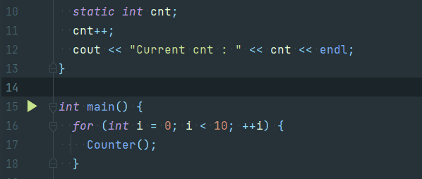

# VIM Tips

## Comment

- To comment multiple line at once, you can type

```
:{startline}, {endline}s/^/{commentType}
````


```
:6,7s/^/#
```

## Uncomment

- To Uncomment multiple line at once is vice versa

```
:{startline}, {endline}s/^{commentType}/
```



```
:6,7s/^#/
```

[link](https://www.usessionbuddy.com/post/How-To-Comment-Out-And-UnComment-Multiple-Lines-At-Once-In-Vim-Editor/)

---

## Screen Move

- To set current line to center, you can type

```
    zz
```


---

## Replace Text

- To replace String in file, you can type

    ```
    :{Scope}/{String1}/{String2}/{Option}
    ```

- Usecase
    1) Replcae all string in file

    ```
    :%s/{String1}/{String2}/g
    ```

    2) Replcae all string in current line (which cursor loacte)

    ```
    :s/{String1}/{String2}/g
    ```

    3) Replace all string from current line to end of file

    ```
    :.,$s/{String1}/{String2}/g
    ```

---

## Adding New Line without Insert mode

- map a new command

    1) Insert new line under current cursor

    ```
    nmap oo o<Esc>k
    ```

    

    2) Insert new line over current cursor

    ```
    nmap OO O<Esc>j
    ```

    

[link](https://stackoverflow.com/questions/16134457/insert-a-newline-without-entering-in-insert-mode-vim)
