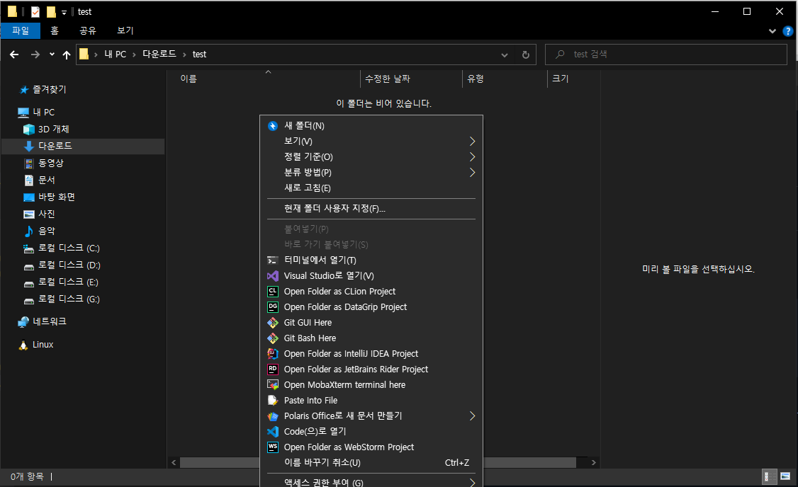
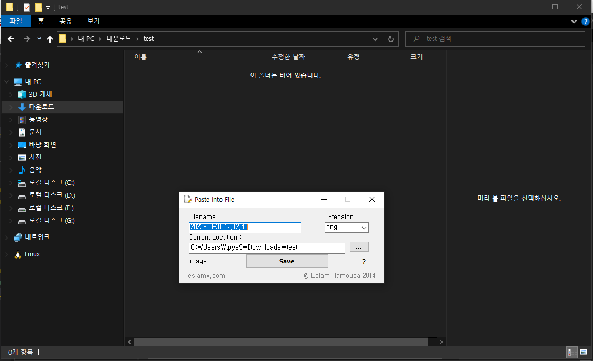
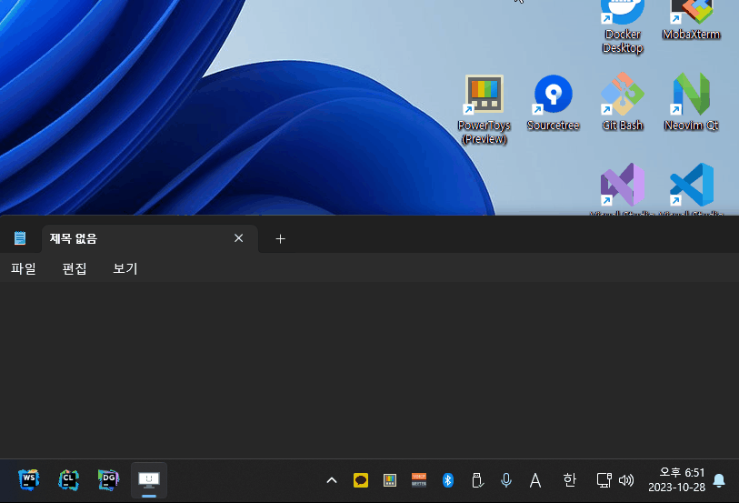

# Windows Util

- [1) Paste Clipboard Contents to Files](#1-paste-clipboard-contents-to-files)

- [2) Search Emoji with enligsh](#2-search-emoji-with-enligsh)


---

## [1) Paste Clipboard Contents to Files](#1-paste-clipboard-contents-to-files)

[Paste Into File](https://github.com/EslaMx7/PasteIntoFile)

- Installation
```
    1) Installing via Chocolatey (require Chocolately)
    choco install pasteintofile

    2) Manuall Install
```

- Usage
    1. Right click in the folder where you want to create file than choose ___Paste Into File___
    

    2. Choose filename, extenstion, location than save
    

- Configuration
    - [Read Docs](https://github.com/EslaMx7/PasteIntoFile#configuration)

## [2) Search Emoji with enligsh](#2-search-emoji-with-enligsh)

- 1) Install `English Langugae pack` from Windows

- 2) `win + space` to change input language

- 3) now use `emoji picker` from window

